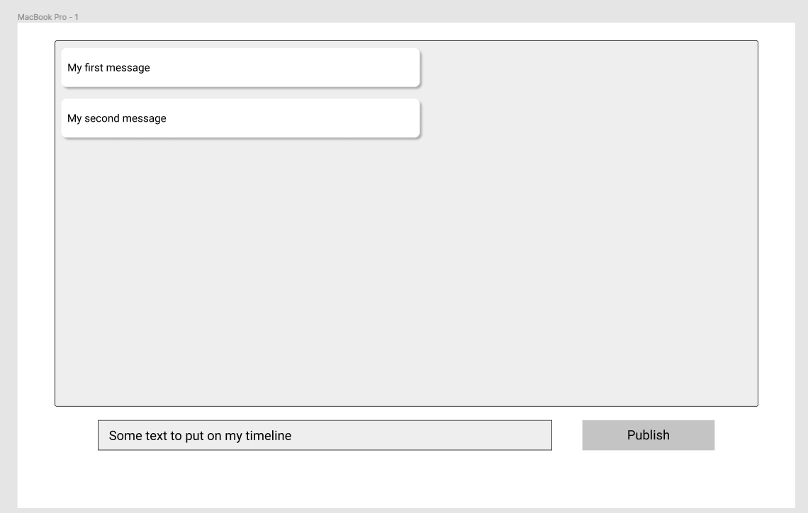

# Social Network Kata

Social Network Kata done w/ Outside-in TDD

Steps:
1) Design of the overall UI
2) Walking skeleton
3) TDD all the things :D 

----

All the views:
1) Personal Timeline
2) Timeline of someone else
3) Personal Wall
4) Wall of someone else

We'll go feature after feature, but FIRST, the Walking Skeletton

## Walking Skeletton
We want to be able to test that all the parts work together.
The parts:
- Back-end application
- Front-end application
- Websocket between the 2 (msg are distributed & sent via websocket)

What is the SMALLEST thing we could do to test that all these parts work together?
- Front end is able to display a HARDCODED message on the backend, sent to it via websocket

## Feature 1) 
Add message to personal timeline, only personal timeline is displayed
